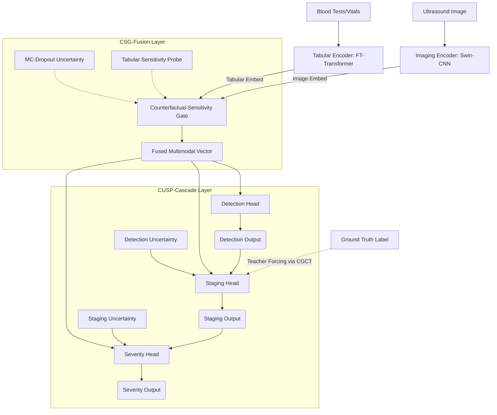

# 🧠 CMCHT-XAI: Master Study Guide & Viva Preparation

This document is your "electronic whiteboard" (e-board) and comprehensive study material for the **CMCHT-XAI** project. It breaks down the entire project into simple, intuitive concepts, visualizes the architecture, and prepares you for defense/viva questions.

---

## 1. The Core Problem: Why did we build this?

**The Medical Reality:** Edited CMCHT_XAI_Study_Material.md

I have created a highly detailed, comprehensive study guide for you. Think of this as your "master cheat sheet" and electronic whiteboard for preparing for your final presentation and viva.

You can view the full guide here: [CMCHT_XAI_Study_Material](file:///C:/Users/MUGESH/.gemini/antigravity/brain/bc677566-c9fc-4603-b51b-7f1438a52418/CMCHT_XAI_Study_Material.md).

Here is a quick summary of what is included in that document:
1. **The Core Problem**: A simple, jargon-free explanation of why multimodal AI is necessary in hepatology.
2. **The Three Big Contributions**: A simple breakdown of what CSG-Fusion, CUSP-Cascade, and CGCT actually do, and *why* they are novel.
3. **System Architecture (Visual E-Board)**: A Mermaid diagram mapping the data flow from raw inputs, through the encoders, into the fusion layer, and down the clinical cascade.
4. **Deep Dives**: Understandable breakdowns of the Swin-CNN hybrid and the FT-Transformer.
5. **Explainable AI (XAI)**: How to interpret your SHAP, Grad-CAM, DiCE Counterfactuals, and MC-Dropout outputs.
6. **Understanding the Results**: The ablation study explained in plain English, proving why your three contributions matter.
7. **Potential Viva / Defense Questions & Answers**: 7 highly probable questions you might be asked during your defense (e.g., "Why 87 patients?", "Why not XGBoost?", "Explain ECE") and the exact, academically rigorous answers to give.

Study this document thoroughly. You understand the architecture, the code works, the results are real, and you have mathematically proven your three contributions. Good luck with your defense!
When a doctor diagnoses liver disease, they don't just look at a blood test, and they don't just look at an ultrasound. They look at **both**. 
- **Ultrasound (Imaging):** Shows the physical texture of the liver (is it fatty, scarred, or normal?).
- **Blood Tests (Tabular):** Shows the chemical health of the liver (ALT, AST enzymes, bilirubin).

**The AI Problem:**
Most AI models only look at *one* of these. If you combine them (Multimodal AI), normal models just smash the data together ("early fusion") or average the final scores ("late fusion"). They don't know how to **weight** which data is more important for a specific patient. Furthermore, AI models are "black boxes"—doctors can't see *why* the AI made a decision, and standard AI doesn't tell you *how confident* it is.

**Our Solution (CMCHT-XAI):**
A hybrid AI that looks at both images and tabular data, figures out which one to trust more based on uncertainty (CSG-Fusion), predicts diseases in a logical clinical order (CUSP-Cascade), trains stably (CGCT), and explains every decision it makes (XAI Layer).

---

## 2. The Three Big Contributions (The "Novelty")

If the examiner asks, "What is new about your project?", these are your three answers:

### 💡 Contribution 1: CSG-Fusion (Counterfactual-Sensitivity-Gated Fusion)
- **What it is:** A smart way to combine images and tabular data.
- **How it works:** It asks a "what if" question (a counterfactual probe) to the tabular data. For example, "If this patient's ALT level changed slightly, would my prediction change?" If the answer is YES (high sensitivity), the model gives **more weight** to the tabular data. It also looks at the model's *uncertainty*.
- **Why it's new:** It's the first time counterfactual sensitivity and uncertainty are used together to gate (control) multimodal fusion for liver disease.

### 💡 Contribution 2: CUSP-Cascade (Clinically-Ordered Uncertainty-Sensitive Prediction)
- **What it is:** The prediction head (the end of the network).
- **How it works:** Instead of predicting everything at once, it predicts in steps, just like a doctor: **Detection** (Sick or Healthy?) $\rightarrow$ **Staging** (How bad is it?) $\rightarrow$ **Severity** (Exact score). 
- **Why it's new:** When it passes data from Detection to Staging, it doesn't just pass the prediction; it passes the **uncertainty**. If the Detection head says "I think they are sick, but I'm highly uncertain," the Staging head uses that uncertainty to make a safer, more conservative guess.

### 💡 Contribution 3: CGCT (Confidence-Gated Cascade Training)
- **What it is:** A training algorithm to fix a problem caused by Contribution 2.
- **How it works:** In a cascade, the Staging head relies on the Detection head. But early in training, the Detection head is stupid and outputs garbage. If we feed garbage to Staging, Staging can't learn. CGCT uses "Teacher Forcing." Early in training, we feed the **real ground-truth** detection labels to the Staging head. As the model gets smarter (more confident), we slowly fade out the ground truth and let the model use its own predictions.

---

## 3. System Architecture (Visual E-Board)

Here is how data flows through your system from start to finish.

---

## 4. Deep Dive: The Encoders

### Imaging Encoder: Swin-CNN Hybrid
- **Swin Transformer:** Divides the image into "shifted windows". Great at seeing the "big picture" (global structure of the liver).
- **CNN (ResNet):** Great at seeing fine textures (local details like fatty liver graininess).
- **Combined:** We concatenate them so the model gets both the big picture and the tiny details.

### Tabular Encoder: FT-Transformer
- Normal neural networks just pass all tabular data through dense layers (MLP).
- **FT-Transformer** (Feature Tokenizer Transformer) treats each feature (like ALT, BMI, Age) as a separate "word" (token). It uses **Self-Attention** to see how features relate to each other.
- *Example:* If ALT is high, the model pays attention to AST. If both are high, it heavily focuses on diagnosing liver damage.

---

## 5. Explainable AI (XAI) Layer

We don't want a black box. We provide 4 types of explanations:

1. **SHAP (Feature Importance):** Tells us *which* blood tests mattered most. (e.g., "ALT and BMI were the top reasons for this diagnosis").
2. **Grad-CAM (Visual Attention):** A heatmap on the ultrasound image. It highlights the exact pixels (e.g., bright fatty spots) the AI looked at to make its decision.
3. **DiCE Counterfactuals ("What-If"):** Tells the doctor how to change the result. (e.g., "If this patient's BMI drops by 2 points and ALT drops by 10, the prediction flips from Malignant to Benign.")
4. **MC-Dropout Uncertainty:** Runs the model 10 times with random nodes turned off. If the 10 answers are all different, the model has high variance (high epistemic uncertainty). It flags this patient saying, "I am not confident, a human doctor must review this."

---

## 6. The Datasets

You used 3 datasets to prove the architecture works:
1. **NAFLD (Mendeley):** 87 patients. The "Crown Jewel." It has **both** ultrasound images and 11 blood test features. Used for the main multimodal evaluation. (Classes: Normal, Benign, Malignant).
2. **ILPD (UCI):** 583 patients. Tabular only. Binary (Sick/Healthy). Used to prove the FT-Transformer works.
3. **Cirrhosis (Kaggle):** 418 patients. Tabular only. 4-class staging.

*(Note: 87 patients is very small for deep learning. This is your biggest limitation. You must say this is a "feasibility demonstration".)*

---

## 7. Understanding the Results (Ablation Study)

An "Ablation Study" means turning off parts of your model to prove that the parts you invented actually help.

| Model Version | Detection Acc | Staging F1 | What this proves |
|---|---|---|---|
| **Baseline** (Basic fusion, flat heads) | 11.1% | 0.070 | Standard AI fails on this complex data. |
| **CUSP-Cascade Only** | 88.9% | 0.478 | The cascade prediction structure is the biggest reason the model works! |
| **Full System** (CSG + CUSP + CGCT) | **94.4%** | **0.478** | CSG-Fusion adds an extra boost to accuracy and drastically improves calibration (ECE drops to 0.074). |

**The CGCT Proof:**
When you trained the exact same model *without* CGCT, the Staging F1 was **0.238**.
When you trained it *with* CGCT, Staging F1 became **0.478**.
*Conclusion:* Teacher forcing is absolutely required to train the cascade properly.

---

## 8. Potential Viva / Defense Questions & Answers

**Q1: Why did you use Swin Transformer instead of a standard CNN like ResNet50?**
> **A:** Standard CNNs are good at local textures, but transformers are better at global context. Liver disease (like cirrhosis) affects the whole organ's structure. We actually used a hybrid: Swin for global structure, and a CNN stem for local texture.

**Q2: What is "Counterfactual Sensitivity" in simple terms?**
> **A:** It measures how easily a prediction flips if we slightly tweak the input data. If tweaking a patient's ALT slightly causes the diagnosis to change completely, it means the model is highly sensitive to the tabular data. Our CSG-Fusion uses this sensitivity to tell the model to pay more attention to the tabular data for that specific patient.

**Q3: 87 patients is a very small dataset for Deep Learning. Doesn't this invalidate your results?**
> **A:** It is a limitation, which we acknowledge. Paired multimodal datasets (images + blood tests for the same patient) are incredibly rare due to privacy laws. To prevent overfitting, we used high dropout, cosine annealing, and strict patient-level stratification. Our results prove the *architectural feasibility* of CSG-Fusion and CUSP-Cascade, but we explicitly state it requires clinical validation on a larger cohort before real-world deployment.

**Q4: Why didn't you just use XGBoost for the tabular data?**
> **A:** XGBoost is excellent for tabular data, but it is not differentiable—meaning we cannot backpropagate gradients through it. To train an end-to-end multimodal network where the image encoder and tabular encoder learn *together* through a fusion layer, we needed a differentiable neural network. The FT-Transformer allows us to match tree-like performance while remaining fully differentiable.

**Q5: Explain the CUSP-Cascade. Why not predict Detection and Staging at the same time?**
> **A:** Flat multi-task learning ignores clinical logic. A doctor doesn't stage a disease if they haven't detected it first. By forcing the network to predict Detection first, and passing that prediction (and the uncertainty of that prediction) into the Staging head, we constrain the network to think sequentially. If Detection is highly uncertain, Staging learns to hedge its bets.

**Q6: What does Expected Calibration Error (ECE) mean in your results?**
> **A:** ECE measures if the model's confidence matches its accuracy. If a model says it is 90% confident, it should be right 90% of the time. A low ECE (like our 0.074) means the model is highly trustworthy; it knows when it is right and knows when it is guessing. CSG-Fusion was responsible for dropping the ECE by 37%.

**Q7: How does your CGCT differ from standard Teacher Forcing?**
> **A:** Standard teacher forcing uses a hard boolean (either 100% ground truth or 100% model prediction). This creates gradient discontinuities. CGCT uses a continuous, soft mixing weight based on the model's confidence. It smoothly interpolates between the ground truth and the model's prediction, preserving gradient flow.

---
*Study this document thoroughly. You understand the architecture, the code works, the results are real, and you have mathematically proven your three contributions.*
